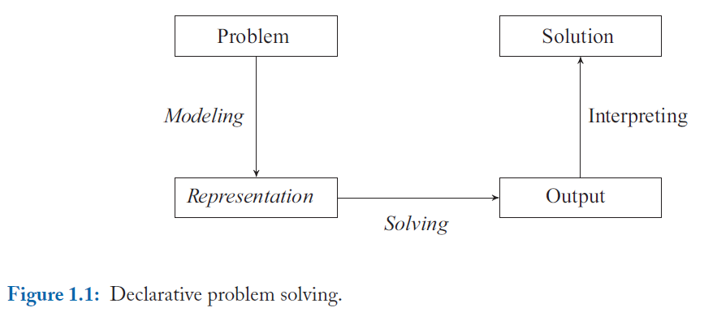

# Motivation

## Answer Set Programming

- An approach to `declarative problem solving`. Rather than solving a problem by telling a computer `how to solve the problem`, the idea is simply to describle `what the problem is` and leave its solution to the computer.

- `Modeling` aims at creating a formal `representation` of the original problem. Instead of merely executing a resulting computer program, the obtained problem representation is used in __solving__ to extract an implicit state space that is explored by sophisticated search algorithms for finding a solution to the original problem.

- The basic idea of ASP is to express a problem in a logical format so that the models of its representation provide the solutions to the original problem. The resulting models are referred as `answer sets`.

- The term ASP is mainly associated with theories in the syntax of `logic programs` under the `stable models semantics` as introduced by `Michale Gelfond and Vladimir Lifschiz in 1988`.

### ASP vs. a traditional logic programming language, i.e. `Prolog`

- Prolog
  - Based on top-down query evaluation in the tradition of Automated Theorem Proving
  - Variables are dealt with via unification and (nested) terms are used as basic data structures.
  - A solution is usually extracted from the instantiation of the variables in a successful query.
  - contitutes a full-fledged programming language and thus equips a user with control over program execution.

- ASP
  - Solutions are captured by models.
  - Computed in a bottom-up fashsion
  - Variables are systematically replaced by using database technique. Hence, tuples and (flat) terms are the prefered data structures.
  - fully decouples a problem's sepcification from how its solution is found.

### ASP vs. SAT

System-wise the focus of SAT lies in solving, while ASP is moreover concerned with modeling.

